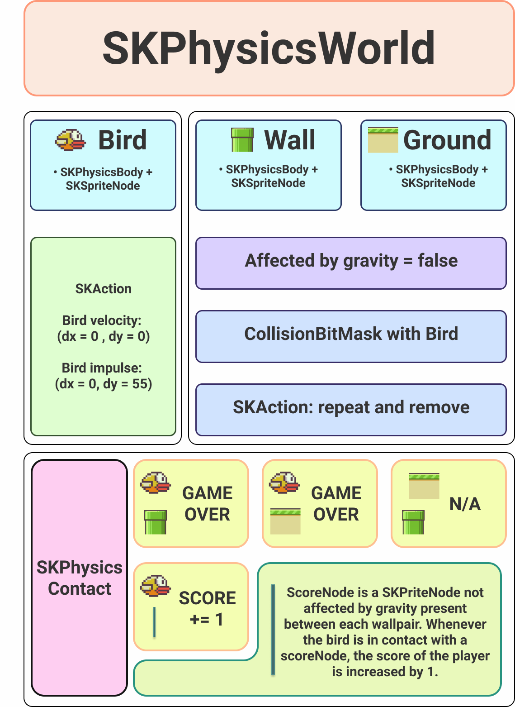

   

  <b>
iFlappy is an iOS game made using Apple's <a href = "https://developer.apple.com/documentation/spritekit/">Spritekit </a> framework. Spritekit provides a ready to use physics engine which perfectly fits this application's requirements. iFlappy is a precise clone of the 2013 viral game 'Flappy Bird'.
  </b>

<h1 align = "center"> Game Demonstration + Logic Diagram </h1>

   

